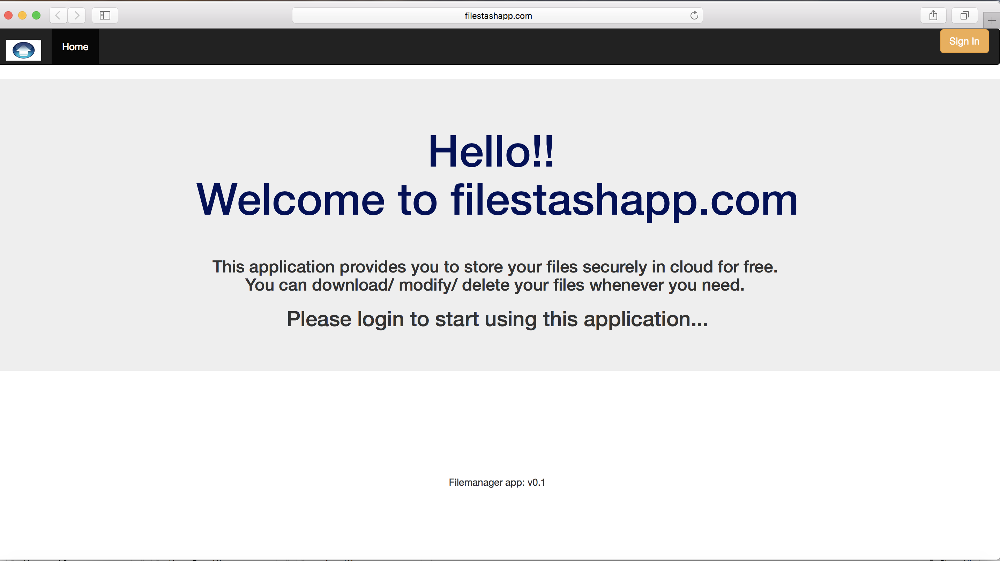

# CMPE281Project1

    University Name: http://www.sjsu.edu/
    Course: Cloud Technologies
    Professor: Sanjay Garje
    ISA: Divyankitha Urs
    Student: Mudrita Chaturvedi
    Linkedin url : www.linkedin.com/in/mudrita-chaturvedi-aa844588

## About Us:
Filestashapp is an application that enables its users to keep their important files and documents safely and securely. It allows its users to access their files worldwide. The application is completely hosted in aws cloud and leverages numerous cloud services provided by aws to make it highly available and scalable.

## Features offered:
Once the user logins to filestashapp, he can perform following operations:

    File upload: Upload file in any format. The size of file should not be more than 10 MB.
    File update: Once the file is uploaded, the user can also update the file. While updating the file, the file name should remain same.
    File delete: If the user does not need that file anymore, the app gives option to delete the file as well.
    File list: User can view all his files that are uploaded in a list.

## Pre-requisites for running this project on local

###  Softwares that needs to be installed:
        • Java downloaded and installed on local machine
        • Maven downloaded and installed on local machine
        • Apache tomcat downloaded and installed on local machine
        • Node and npm downloaded and installed on local machine
        • Git downloaded and installed

### Cloud Resources that needs to be created before running this application on local machine
        • S3 bucket with s3 transfer acceleration enabled.
        • Cloudfront for the S3 bucket that is created.
        • MYSQL RDS server with single AZ for database
        • IAM user that has get/put/delete access on the bucket created.

## Running the project from local
        • To run the project from local machine firstly clone the repository on your machine.
        • create .aws directory and store your IAM user's credentials file(created above) inside this directory.
        ### Running core server:
            • Give RDS properties for RDS server that you created above inside filestashCore/src/main/resources/database.properties file.
            • Give bucket name and cloudfront name in filestashCore/src/main/java/org/CMPE281/filemanager/dal/s3uploadDaoImpl.java file
            • Open terminal if you are using MAC.
            • cd to the location where repository is cloned till filestashCore directory.
            • Now run command "mvn clean install".
            • This will create a war file for the core layer.
            • Copy the war file created and put it inside webapp directory of Tomcat server.
            • This will start your core layer server.
        ### Running web server:
            • Now to start web layer server, go to terminal again.
            • cd to location where repository is cloned till filestashView directory.
            • Now run command "node scripts/web-server.js"
            • This will start your web server on port 8000.
            
## Home Page

## Login window

## Home  page after login

## Upload window

## Update window

